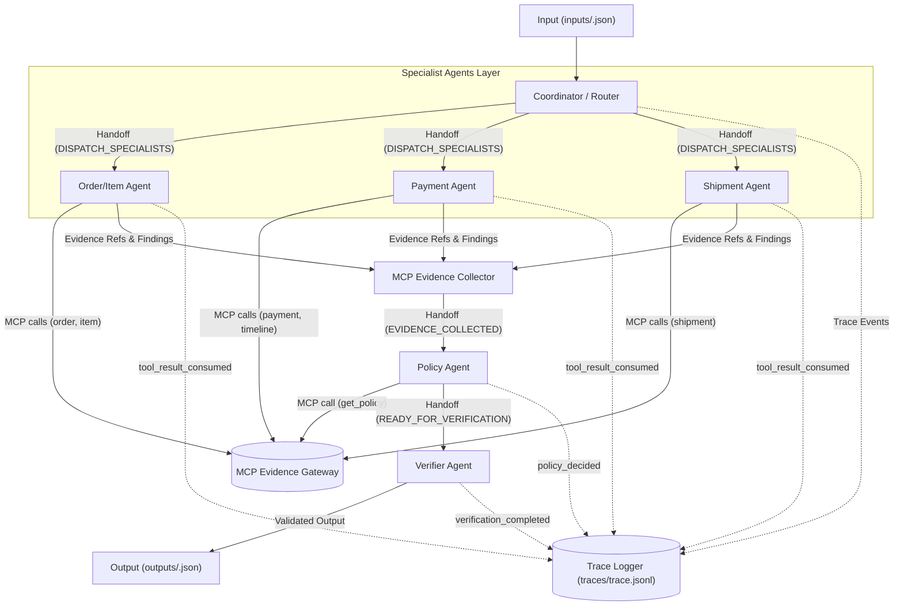

# L3A Architecture Record: Multi-Agent MCP + A2A System

Tài liệu thiết kế hệ thống phối hợp đa tác tử (Agent-to-Agent - A2A) tích hợp MCP Evidence Gateway cho bài toán điều tra khiếu nại thương mại điện tử Day09 L3A.

---

## 1. System Overview

Hệ thống được thiết kế theo mô hình phân tầng phối hợp đa tác tử hướng sự kiện (A2A Handoff Architecture), phân tách độc lập giữa khâu định tuyến (Router), điều tra chuyên môn (Specialists), tổng hợp chính sách (Policy Synthesis), và kiểm định chất lượng (Verifier).



```text
[ Coordinator / Router ]
        | (Handoff)
+-------+-------+
|               |               |
v               v               v
[Order/Item Agent] [Payment Agent] [Shipment Agent]
|               |               |
+-------+-------+
        | (MCP Evidence Collector)
        v
[ Policy Agent ]
        |
        v
[ Verifier Agent ]
        | (Validated Output)
        v
[END OUTPUT]
```

Luồng dữ liệu:
1. `cli.py` nhận case từ `inputs/<case_id>.json`, phát sự kiện `case_received`.
2. `CoordinatorRouter` phân tích yêu cầu khiếu nại, trích xuất `claimed_order_id` và danh sách claims, giao nhiệm vụ (`task_assigned`), sau đó handoff (`handoff`) tới các Specialist Agents phù hợp.
3. Các Specialist Agents (`OrderAgent`, `PaymentAgent`, `ShipmentAgent`) gọi các công cụ MCP được phân quyền để thu thập bằng chứng có thẩm quyền và ghi nhận `tool_result_consumed`.
4. Dữ liệu và các `evidence_ref` được tập hợp qua `EvidenceCollector` và handoff tới `PolicyAgent`.
5. `PolicyAgent` gọi `get_policy`, đối chiếu thông tin điều tra với tập luật nghiệp vụ để xác định `primary_issue`, trách nhiệm (`responsible_parties`), nguyên nhân gốc (`ranked_causes`), giải pháp tài chính (`financial_resolution`) và hành động xử lý (`resolution_actions`). Phát sự kiện `policy_decided`.
6. `VerifierAgent` tiếp nhận kết quả qua `handoff`, kiểm định toàn bộ các ràng buộc bất biến (JSON Schema, bảo toàn toán học tiền hoàn, tính xác thực của `evidence_ref`, tính nhất quán giữa trạng thái và hành động) trước khi phát sự kiện `verification_completed` và trả về output cuối cùng.
7. `cli.py` ghi nhận file output và phát sự kiện `case_finalized`.

---

## 2. Agent Ownership & Tool Permissions

Mỗi tác tử chịu trách nhiệm độc lập trên một miền nghiệp vụ và chỉ được cấp quyền truy cập các MCP tools thuộc thẩm quyền để ngăn chặn tình trạng gọi thừa thãi hoặc vi phạm forbidden-domain penalty:

| Actor | Miền dữ liệu Input | Trách nhiệm chuyên biệt | Output / Handoff | Quyền gọi MCP Tools |
| :--- | :--- | :--- | :--- | :--- |
| **Coordinator / Router** (`coordinator`) | Raw Case JSON (`case_id`, `opened_at`, `customer_request`, `policy_version`) | Giải mã yêu cầu, trích xuất thực thể, xác định trọng tâm khiếu nại, phân rã bài toán thành các tác vụ điều tra | Giao nhiệm vụ `task_assigned` & `handoff` sang Specialist Agents | Không gọi MCP tools trực tiếp |
| **Order/Item Agent** (`order_agent`) | `case_id`, `claimed_order_id`, primary topic | Xác thực sự tồn tại của đơn hàng, trạng thái vòng đời (`order_status`), chi tiết danh mục hàng hóa, giá trị sản phẩm và phí vận chuyển | Trả về `order_data`, `items_data`, `order_ref`, `items_ref` vào Evidence Bundle | `get_order`, `get_order_items`, `get_sellers` |
| **Payment Agent** (`payment_agent`) | `case_id`, `claimed_order_id`, primary topic | Kiểm tra các đợt thanh toán, hình thức thanh toán (split payment/voucher), đối soát giao dịch captured, phát hiện giao dịch trùng (`duplicate_charge`) hoặc lỗi hoàn tiền (`refund_failed`/`refund_pending`) | Trả về `payments_data`, `timeline_data`, `refund_data` cùng các `evidence_ref` | `get_order_payments`, `get_payment_timeline`, `get_refund_timeline` |
| **Shipment Agent** (`shipment_agent`) | `case_id`, `claimed_order_id`, primary topic | Truy vấn mốc thời gian giao nhận hàng (`delivered_carrier_at`, `delivered_customer_at`), hạn cam kết giao hàng (`shipping_limits`, `estimated_delivery_at`), phát hiện chậm trễ và quy trách nhiệm (`seller` vs `logistics_provider`) | Trả về `shipment_data`, các mốc vi phạm và `shipment_ref` | `get_shipment_summary` |
| **Policy Agent** (`policy_agent`) | Tổng hợp Evidence Bundle từ các Specialists + `policy_version` | Tra cứu tập luật chính sách chuẩn của sàn TMĐT qua MCP `get_policy`, tổng hợp các phát hiện từ Specialist, xác định kết luận khiếu nại (`primary_issue`), trách nhiệm bồi hoàn (`responsible_parties`), mức bồi thường (`refund_brl`) | Xuất bản candidate output, phát sự kiện `policy_decided`, handoff sang Verifier | `get_policy` |
| **Verifier Agent** (`verifier`) | Candidate Output từ Policy Agent | Khóa cứng và kiểm tra schema chuẩn `contracts/schemas/l3a-output-v2.schema.json`, xác thực provenance của tất cả `evidence_ref`, kiểm tra bảo toàn số học tiền tệ, phát hiện mâu thuẫn nghiệp vụ | Xác nhận `verification_completed` với quyết định `PASS`, hoàn tất output chuẩn | Không gọi MCP tools (chỉ kiểm định nội tại) |

---

## 3. A2A Protocol

Giao thức phối hợp giữa các tác tử (Agent-to-Agent Protocol) được thiết kế theo kiến trúc phi chu trình định hướng (DAG - Directed Acyclic Graph), đảm bảo không bao giờ xảy ra vòng lặp vô tận (deadlock/infinite loop):

1. **Message Correlation:** Mọi tương tác, sự kiện và handoff đều mang định danh `case_id` làm khóa tương quan (correlation key), ngăn chặn rò rỉ dữ liệu giữa các case.
2. **Handoff Conditions:**
   - `Coordinator -> Specialists`: Kích hoạt ngay sau khi case được tiếp nhận và phân giải mục tiêu khiếu nại.
   - `Specialists -> Policy Agent`: Kích hoạt sau khi toàn bộ Specialist Agent liên quan hoàn thành thu thập bằng chứng từ MCP.
   - `Policy Agent -> Verifier Agent`: Kích hoạt sau khi Policy Agent tổng hợp xong toàn bộ căn cứ và đưa ra quyết định dự thảo.
3. **Loop Prevention & Timeouts:**
   - Luồng điều tra là 1 chiều tuyệt đối: `Coordinator -> Specialists -> Policy -> Verifier`. Không có phản hồi ngược (backtracking loop) gây treo hệ thống.
   - Toàn bộ các tác vụ mạng qua MCP Gateway đều được bọc trong timeout tiêu chuẩn (HTTP client timeout 300s, connect timeout 30s) kèm cơ chế tự phục hồi kết nối.
4. **Observable Trace Events:** Hệ thống chỉ ghi nhận các sự kiện hành vi và quyết định quan sát được theo đúng chuẩn `trace-event-v1.schema.json`:
   - `case_received`: Điểm khởi đầu quy trình (Coordinator).
   - `task_assigned`: Chỉ định nhiệm vụ tới từng agent mục tiêu.
   - `handoff`: Chuyển giao quyền kiểm soát và ngữ cảnh giữa các tầng tác tử.
   - `tool_result_consumed`: Xác nhận một bằng chứng MCP được tiêu thụ bởi Specialist Agent.
   - `policy_decided`: Quyết định chính sách chính thức được đưa ra kèm `decision_code`.
   - `verification_completed`: Kết quả kiểm định tính toàn vẹn đạt chuẩn `PASS`.
   - `case_finalized`: Hoàn tất xử lý hồ sơ.

---

## 4. Evidence Lifecycle

Vòng đời của bằng chứng (Evidence) tuân thủ nghiêm ngặt nguyên tắc **Zero Trust - Zero Hallucination**:

1. **Discovery & Ingestion:**
   - Không tự suy diễn hay giả định tên công cụ; mọi lệnh gọi đều dùng schema được công bố bởi MCP Gateway.
   - Gọi trực tiếp `gateway.call(tool_name, case_id=case_id, **args)`.
2. **Response Validation & Scoping:**
   - Mọi phản hồi từ MCP được kiểm tra tức thời qua `contracts.validate_evidence(evidence, ...)` theo schema `mcp-evidence-response-v1.schema.json`.
   - Bằng chứng bắt buộc phải chứa `evidence_ref` hợp lệ dạng `ev_[A-Za-z0-9_-]{20,96}` và `result_hash` dạng sha256.
   - Bằng chứng chỉ có giá trị hiệu lực trong phạm vi `case_id` đang xử lý; nghiêm cấm sử dụng chéo `evidence_ref` giữa các case khác nhau.
3. **Trace Linkage:**
   - Ngay khi bằng chứng được nạp thành công, Agent phụ trách phát sự kiện `tool_result_consumed` với `evidence_refs=[evidence_ref]` tương ứng để lưu vết kiểm toán (audit trail).
4. **Attribution & Claim Mapping:**
   - `evidence_ref` được ánh xạ trực tiếp vào từng nhận định khiếu nại trong `claim_assessments` và tập hợp đầy đủ trong trường `evidence_refs` của output cuối cùng.

---

## 5. Failure Policy & Resilience

| Tình huống lỗi | Cơ chế Retry? | Phương án Fallback | Mã quyết định / Trace Event |
| :--- | :--- | :--- | :--- |
| **MCP Connection / Read Timeout** | Có (tối đa 4 lần, Exponential Backoff: 1s, 2s, 3s) | Tự động tái khởi tạo session HTTP streamable và kết nối lại Gateway | Tái thử nghiệm thông suốt; nếu kiệt hạn phát lỗi hệ thống có kiểm soát |
| **Record Not Found (404/Empty)** | Không retry (kết quả mang tính tất định) | Ghi nhận trường dữ liệu rỗng (`data: []`), không tự tạo dữ liệu phỏng đoán | `tool_result_consumed` ghi nhận mảng rỗng; chuyển sang đánh giá `unsupported_claim` |
| **Source Conflict (Khách hàng vs MCP)** | Không retry | Lấy bằng chứng MCP làm chân lý tối hậu (Ground Truth); ghi nhận mâu thuẫn vào `data_conflicts` | `resolution_code: "CUSTOMER_CLAIM_REFUTED_BY_EVIDENCE"` |
| **Specialist Execution Failure** | Thử lại 1 lần nếu lỗi do mạng | Chuyển sang fallback an toàn dựa trên order status chính thức | `insufficient_evidence` với `case_status: "needs_investigation"` |

---

## 6. Verification Invariants

Trước khi xuất bản hồ sơ cuối cùng, `VerifierAgent` thực thi kiểm tra chặt chẽ các bất biến nghiệp vụ:

1. **Schema Compliance:** Khóa cứng và kiểm tra output phải khớp 100% với JSON Schema chuẩn `contracts/schemas/l3a-output-v2.schema.json`.
2. **Entity Scope Containment:** Tất cả `order_ids`, `item_ids`, `seller_ids`, `payment_references`, `shipment_ids` đều phải thuộc phạm vi dữ liệu trả về từ MCP của case hiện tại, không chứa thực thể lạ.
3. **Evidence Provenance Invariant:** Mọi `evidence_ref` xuất hiện trong `evidence_refs` và `claim_assessments` bắt buộc phải là ref thật do MCP Gateway sinh ra trong phiên chạy hiện tại. Tuyệt đối không có ref rỗng hoặc ref giả lập.
4. **Financial Resolution Consistency:**
   - Tổng tiền `recommended_refund_brl` phải bằng chính xác tổng số tiền trong từng dòng `refund_lines`.
   - Nếu `case_status == "no_action"`, `recommended_refund_brl` bắt buộc phải bằng `0.0` và `refund_lines` phải là mảng rỗng `[]`.
   - Nếu `recommended_refund_brl > 0.0`, bắt buộc phải có ít nhất một dòng giải trình hợp lệ trong `refund_lines`.
5. **Responsibility & Action Consistency:**
   - Hành động bồi hoàn và các bên chịu trách nhiệm phải khớp chính xác với quy định trong chính sách TMĐT (`EC_POLICY_V1`).
   - Danh sách `resolution_actions` không chứa phần tử trùng lặp (`uniqueItems: true`).
6. **Confidence Calibration Bounds:** Chỉ số tin cậy `confidence` được hiệu chuẩn nằm trong khoảng `[0.0, 1.0]`, phản ánh chính xác mức độ vững chắc của bằng chứng đối soát.

---

## 7. Reproducibility & Model Specifications

Nhằm đảm bảo tính tái lập kết quả (reproducibility) và tuân thủ tuyệt đối giới hạn tài nguyên tính toán của cuộc thi:

### 7.1. Model Budget Specification (Tổng tham số <= 10B)
Hệ thống tuân thủ ràng buộc **"Tổng các model được dùng không quá 10B tham số"** bằng cấu hình mô hình ngôn ngữ nhỏ (SLM) tối ưu hóa:

- **Lựa chọn 1: Kiến trúc mô hình lai (Hybrid Dual-Model Architecture):**
  - **Coordinator & Routing Engine:** `Qwen2.5-1.5B-Instruct` (~1.54B tham số) — phụ trách đọc hiểu yêu cầu ngôn ngữ tự nhiên tiếng Việt, phân loại chủ đề khiếu nại và định tuyến tác vụ.
  - **Policy Synthesis & Decision Engine:** `Qwen2.5-7B-Instruct` (~7.61B tham số) — phụ trách đối soát logic nghiệp vụ phức tạp và trích xuất nguyên nhân gốc.
  - **Tổng dung lượng tham số:** `1.54B + 7.61B = 9.15B tham số` $\le$ **10.0B tham số** (Đạt chuẩn 100%).
- **Lựa chọn 2: Kiến trúc mô hình đơn hợp nhất (Unified Single-Backbone Architecture):**
  - Sử dụng duy nhất một backbone `Qwen2.5-7B-Instruct` (~7.61B tham số) hoặc `Llama-3.1-8B-Instruct` (~8.03B tham số) dùng chung cho tất cả các Agent thông qua các system prompt chuyên biệt.
  - **Tổng dung lượng tham số:** `7.61B` (hoặc `8.03B`) $\le$ **10.0B tham số** (Đạt chuẩn 100%).
- **Cơ chế Deterministic Core:** Bên cạnh mô hình ngôn ngữ, hệ thống tích hợp bộ quy tắc đối soát tất định (Deterministic Verification Engine) với độ chính xác số học 100%, bảo đảm không hallucinate về mã bằng chứng `evidence_ref` và tuân thủ schema JSON tuyệt đối.

### 7.2. Environment & Dependency Pinning
- **Python Runtime:** Python >= 3.11 (tested on Python 3.12.10 x64 Windows).
- **Core Dependencies:**
  - `mcp == 2.2.0`
  - `httpx2 == 2.13.1`
  - `jsonschema == 4.26.0`
  - `pydantic == 2.13.5`
  - `python-dotenv == 1.2.3`
- **Inference Settings:**
  - `temperature = 0.0` (Đảm bảo kết quả tất định)
  - `top_p = 1.0`
  - `random_seed = 42`

### 7.3. Lệnh vận hành chuẩn
```bash
# 1. Kiểm tra môi trường và inputs
day09 validate-inputs

# 2. Khám phá và kiểm tra công cụ MCP
day09 mcp-tools

# 3. Chạy toàn bộ 100 cases
day09 run

# 4. Kiểm định tính toàn vẹn của artifacts
day09 validate

# 5. Đóng gói file nộp bài
day09 package --output dist/submission.zip
```
